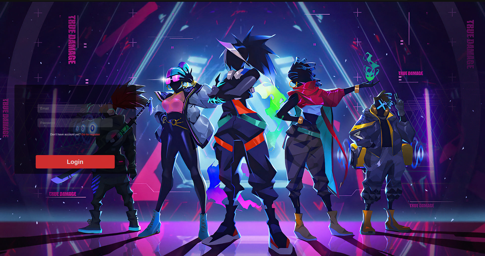
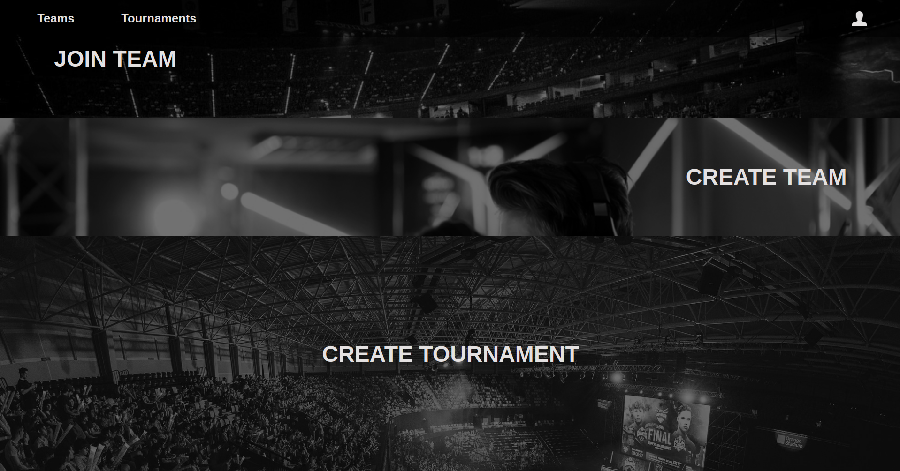

# tournament manager
## What is this project?

I'm creating this one to befriend with Vue+Nuxt stack.<br />
This app is tournament managment system, where users can create their own tournaments or join to the others.

## Build Setup

```bash
# install dependencies
$ npm install

# serve with hot reload at localhost:3000
$ npm run dev

# build for production and launch server
$ npm run build
$ npm run start

# generate static project
$ npm run generate
```

## Screenshots <br/>
<br />
<br />

